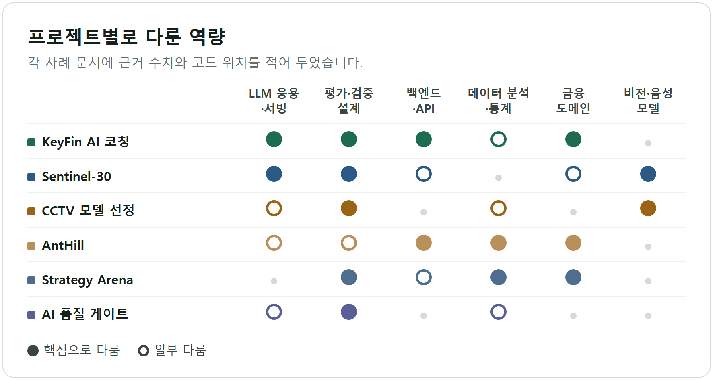
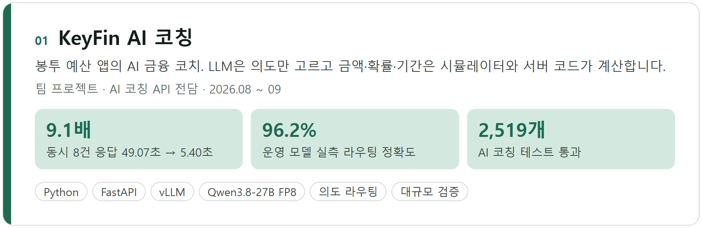
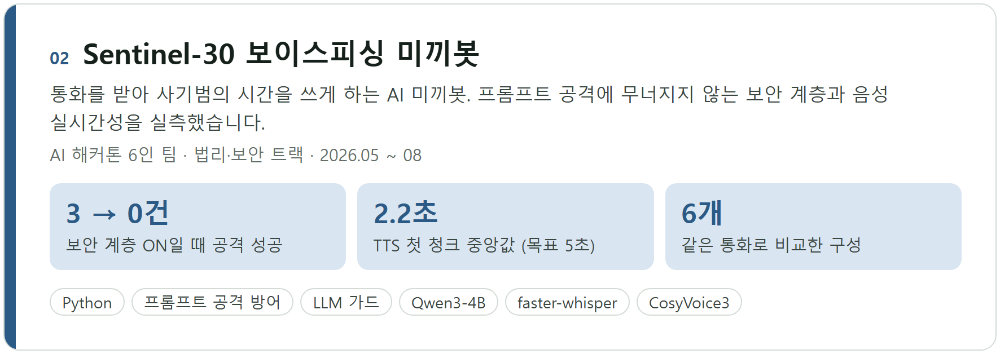
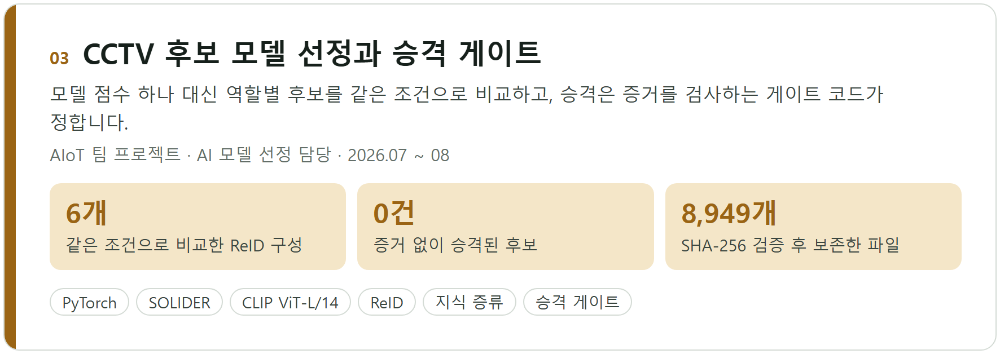
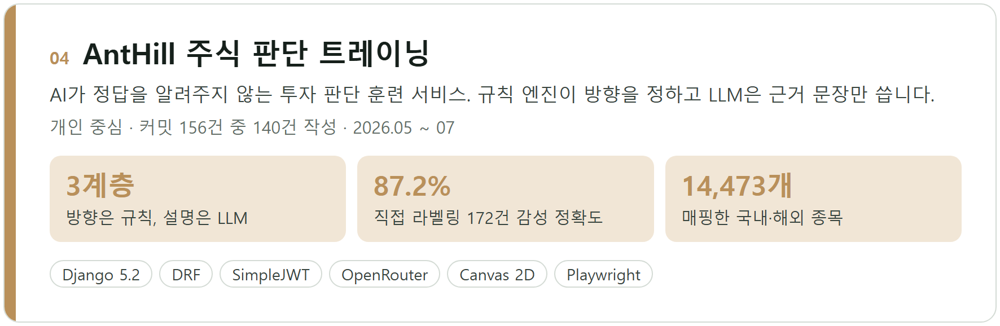
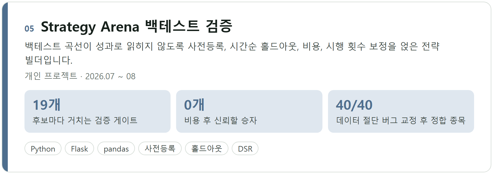
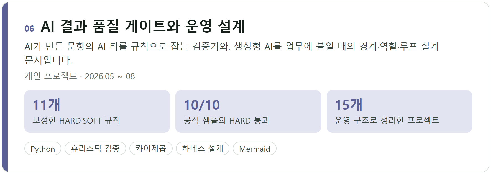

# 포트폴리오

금융 서비스와 업무에 AI를 붙일 때, 틀리면 안 되는 부분은 코드로 지키고 결과는 수치로 확인합니다. 아래 여섯 사례는 모두 저장소의 코드·결과 파일·설계 문서로 확인할 수 있고, 문서마다 근거 위치를 적었습니다.

- 관심 직무: 금융 IT·디지털 ICT, AI·데이터 제품 엔지니어, AI 기반 서비스 기획
- 주로 쓰는 기술: Python, FastAPI·Django·Flask, SQL, vLLM, PyTorch, LLM 라우팅과 평가 설계

## 사례

카드를 누르면 사례 문서로 이동합니다. 문서는 문제, 내가 한 일과 설계 결정, 결과와 검증, 한계 순서로 정리했습니다.

[사례 문서](projects/01-keyfin-ai-coaching.md) · [팀 저장소 (`ai/` 담당)](https://github.com/tttksj404/KeyFin)

[사례 문서](projects/02-sentinel-30.md) · [저장소](https://github.com/tttksj404/AI-)

[사례 문서](projects/03-cctv-model-selection.md) · [저장소](https://github.com/tttksj404/cctv-model-selection-lab)

[사례 문서](projects/04-anthill-stockpulse.md) · 저장소 비공개 (요청 시 공유)

[사례 문서](projects/05-strategy-arena.md) · [저장소](https://github.com/tttksj404/strategy-arena)

[사례 문서](projects/06-ai-quality-tools.md) · [quiz-validator](https://github.com/tttksj404/quiz-validator) · [ai-harness-loop-orchestration](https://github.com/tttksj404/ai-harness-loop-orchestration)

## 일하는 방식

**숫자와 판정은 코드가, 설명은 모델이 맡습니다.** KeyFin에서 LLM은 질문의 의도만 고르고 금액·확률·기간은 시뮬레이터가 계산합니다. AntHill에서도 매수·보유·매도 방향은 규칙 엔진이 계산하고 LLM은 근거 문장만 씁니다. 모델을 바꾸거나 프롬프트를 고쳐도 핵심 수치가 흔들리지 않게 하려는 구조입니다.

**통과 기준을 먼저 정하고 결과를 봅니다.** Strategy Arena는 후보와 비용, 분할을 먼저 동결한 뒤 평가했고, CCTV 실험은 승격을 사람이 표를 읽는 대신 증거를 검사하는 게이트 코드에 맡겼습니다. quiz-validator는 사람이 쓴 공식 샘플로 규칙을 보정했습니다.

**검증하지 못한 것은 검증하지 못했다고 적습니다.** Sentinel-30의 5초 목표 미달, CCTV에서 승격하지 못한 후보, Strategy Arena에서 비용을 반영하자 사라진 전략도 결과로 남겼습니다. 합성 데이터나 공개 proxy로 잰 수치는 문서마다 그 범위를 밝혔습니다.

## 그 밖의 저장소

- [palantir-ax-playbook](https://github.com/tttksj404/palantir-ax-playbook): 공개 자료로 정리한 기업 AX 도입·운영 방식 학습 노트
- [realestate-economy](https://github.com/tttksj404/realestate-economy): 부동산 매물·공매 데이터로 경기 신호를 보는 데이터 서비스 프로토타입

## 이 저장소의 그림

모든 그림은 각 원 저장소 결과 파일의 수치로 다시 그렸습니다. GitHub 본문 폭에서 그대로 읽히도록 880px 기준으로 만들었고, 생성 코드는 [`src/`](src/)에 있습니다.
