# KeyFin AI 코칭 — 숫자는 틀리지 않는 금융 코치

봉투 예산 앱 KeyFin에서 사용자의 질문과 결제에 답하는 AI 코칭 서버를 맡았다. LLM은 질문의 의도만 고르고, 금액·확률·기간은 팀의 FDT 시뮬레이터와 서버 코드가 계산한다. 모델이 틀려도 금융 숫자는 틀리지 않게 하는 것이 설계의 중심이었다.

| 항목 | 내용 |
| --- | --- |
| 기간 | 2026.08.18 ~ 09.29 (SSAFY 2학기 핀테크 팀 프로젝트) |
| 형태 | 팀 프로젝트. 본인 담당은 AI 코칭 API(`ai/` 전체). 앱·백엔드·FDT 엔진은 팀원 담당 |
| 핵심 기술 | Python 3.12, FastAPI, Pydantic 2, SQLite, vLLM 0.19, Qwen3.8-27B FP8, NVIDIA L40S |
| 대표 결과 | 동시 8건 응답 p50 49.07초 → 5.40초(9.1배), 실모델 라우팅 정확도 96.2%(4,969문항) |
| 규모 | AI 코칭 커밋 146개, develop에 병합된 AI MR 24건, 테스트 856 → 2,519개 + e2e 41개 |

## 무엇을 하는 서비스인가

사용자가 채팅으로 묻거나 결제하면 AI 코칭이 그 사람의 거래 원장으로 계산해 답한다. 구매해도 되는지, 봉투에 얼마가 남았는지, 이번 달 소비가 어떻게 될지를 숫자로 보여 주고, 금융 개념은 승인된 카드 27개 안에서만 설명한다. 금액이 빠진 질문은 추측하지 않고 그 항목만 되묻는다.

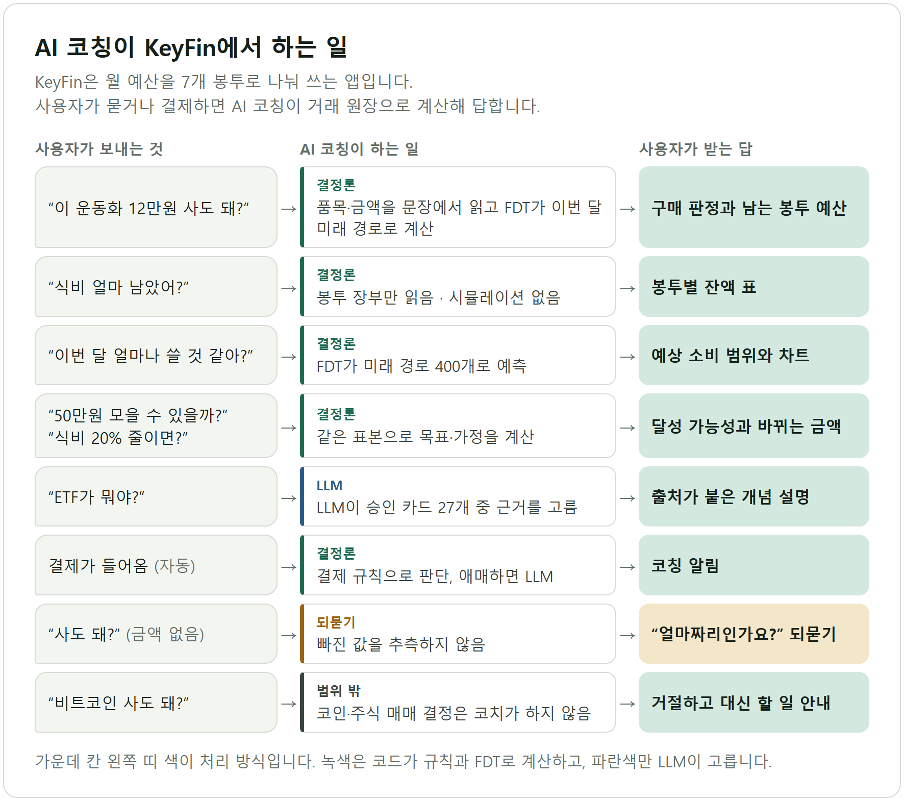

## 구성

앱은 백엔드만 부르고, 백엔드가 코칭 API를 호출한다. 코칭 API 안에서 요청은 입구 → 의도 판별 → FDT 계산 → 수치 검증 → 답변 조립 순서로 지나간다. LLM은 별도 GPU 워커에서 돌고, GPU 서버가 밖으로만 연결할 수 있어 워커가 먼저 WebSocket 역터널을 연다.

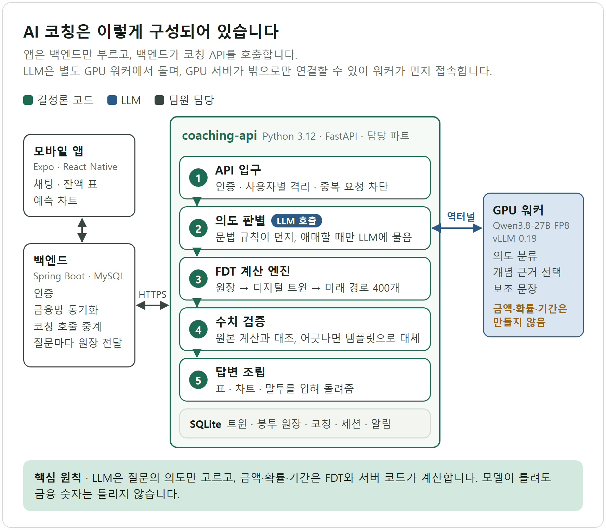

## 설계 결정

### 1. LLM에게 숫자를 맡기지 않았다

금융 코치가 가장 위험하게 실패하는 순간은 그럴듯한 틀린 숫자를 내놓을 때이다. 그래서 LLM의 역할을 의도 분류와 근거 선택으로 좁혔다. 금액·확률·기간은 FDT가 계산하고, 답변에 들어가는 모든 수치는 원본 계산 결과(receipt)와 다시 대조한다. 어긋나면 LLM 문장을 버리고 템플릿으로 답한다. 개념 설명도 승인 카드 원문만 쓰고 LLM은 카드 ID만 고른다.

### 2. 문법이 먼저, LLM은 애매할 때만

모든 질문을 LLM에 보내면 느리고, 매번 분류가 흔들린다. 잔액 확인이나 "식비 20% 줄이면" 같은 질문은 문법으로 뜻이 확정되므로 LLM을 부르지 않게 했다. 확실할 때만 결정하고 애매하면 손을 떼는 규칙이라, 문법이 틀린 길로 끌고 가는 일을 막는다. 570문항 기준으로 모델을 부르는 질문이 135개에서 94개로 줄었다.

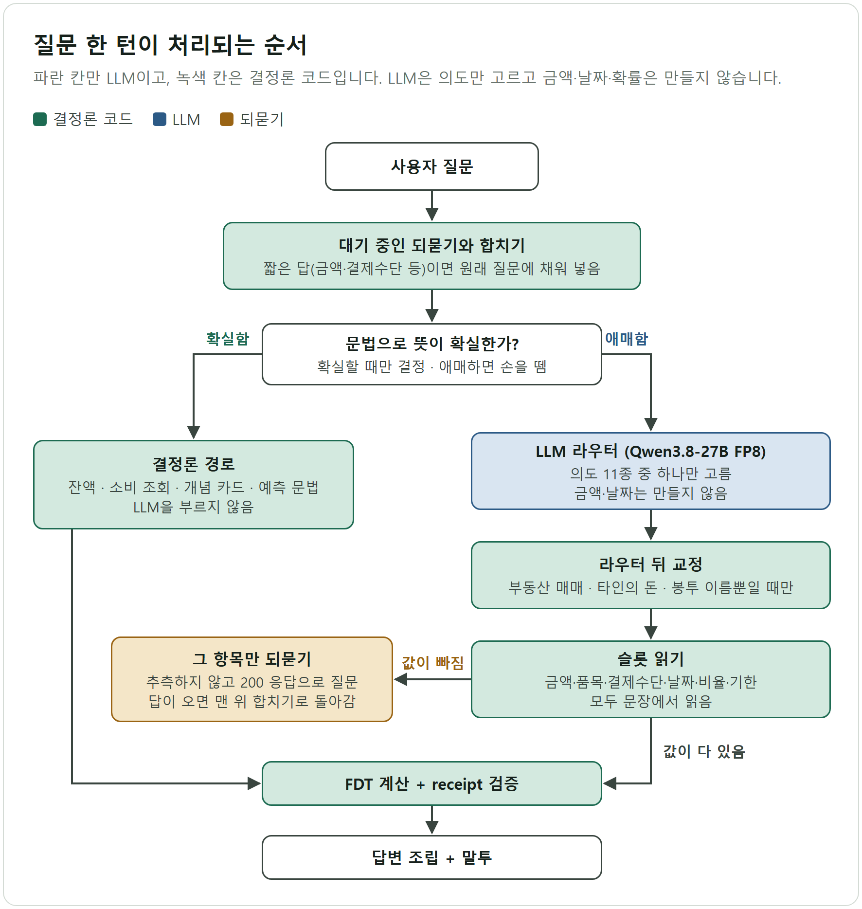

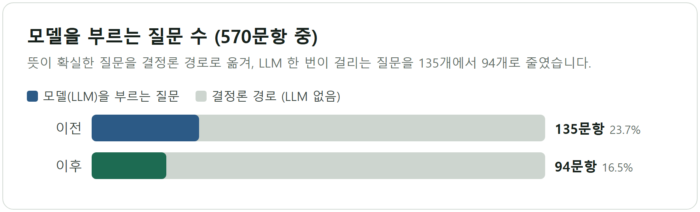

### 3. 작은 모델 대신 큰 모델을 가볍게

속도를 위해 8B 모델로 바꾸는 방안을 먼저 실험했다. 144문항 사전 실험에서 27B는 틀린 답을 그대로 받아들인 횟수가 0건, 8B는 23건이었다. 8B도 규칙과 LoRA를 붙이면 따라오지만, 그만큼 사람이 만든 규칙에 기대야 했다. 그래서 27B를 유지하고 공식 FP8 가중치와 vLLM으로 서빙 방식을 바꿨다. BF16(약 54GB)은 L40S 한 장(46GB)에 들어가지 않고, FP8(약 29GB)은 KV 캐시 자리를 남기고 들어간다.

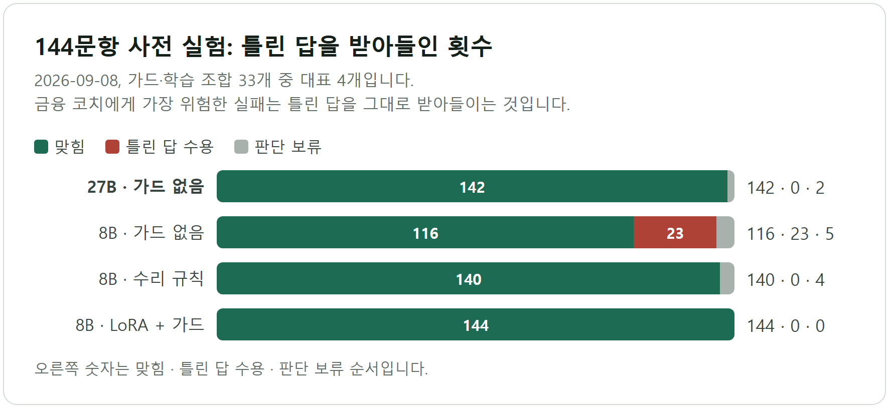

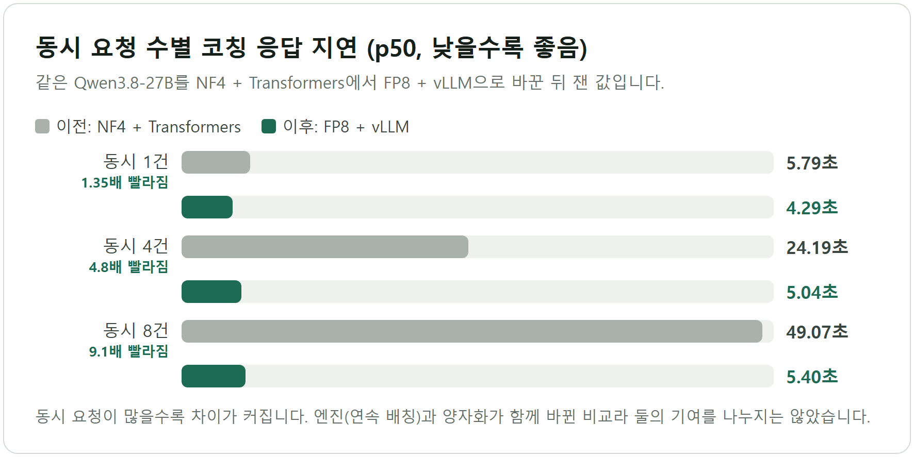

### 4. 수천 개 질문으로 의도 판별을 검증했다

사람이 떠올린 테스트 질문으로는 실제 말투를 다 덮지 못했다. 여러 생성 모델로 질문 약 5,200개를 만들고, 대화 맥락 9종과 대화 흐름 220여 개에 넣어 돌렸다. 운영 모델을 여유 GPU에 따로 띄워 실제로 채점하고, 실모델이 고른 결과를 파이프라인에 다시 흘려 "라우터는 맞았는데 답이 틀린" 경우를 따로 골라냈다. 운영 GPU는 건드리지 않았다.

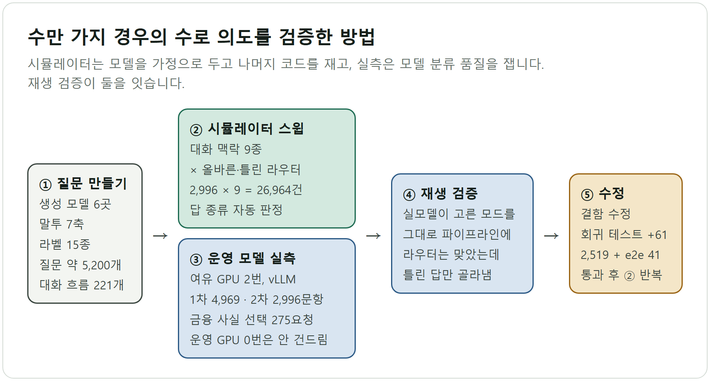

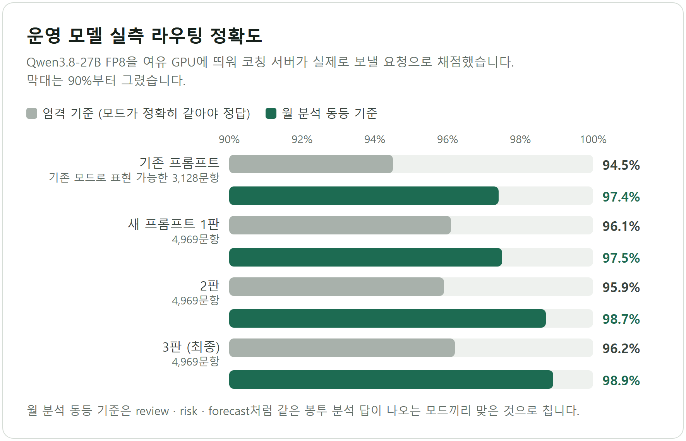

## 결과

| 항목 | 결과 |
| --- | --- |
| 응답 속도 | 동시 8건 p50 49.07초 → 5.40초 (NF4 + transformers → FP8 + vLLM) |
| 모델 호출 | 모델을 부르는 질문 23.7% → 16.5% (570문항) |
| 라우팅 정확도 | 새 프롬프트 96.2%(4,969문항). 기존 프롬프트는 기존 모드로 표현할 수 있는 3,128문항에서 94.5%였다. 운영 모델 실측, 엄격 기준 |
| 의도 검증 | 재생 검증에서 라우터가 맞았는데 답이 틀린 문항 475 → 448, 대화 흐름 오답 45 → 13 |
| 예측 엔진 비교 | 합성 336사례 WAPE: FDT 61.42%, Chronos-2 70.17~75.90%(추가학습 여부·집계 방식별), TimesFM 86.83% → 신경망 예측기로 바꾸지 않음 |
| 품질 | AI 코칭 테스트 2,519개 + e2e 41개 통과. 잔액·예측 분리 수정은 뮤테이션 6/6을 테스트가 모두 잡음 |

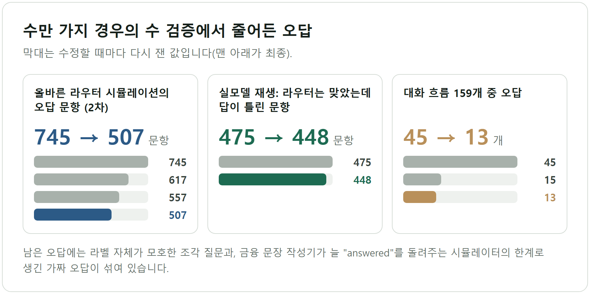

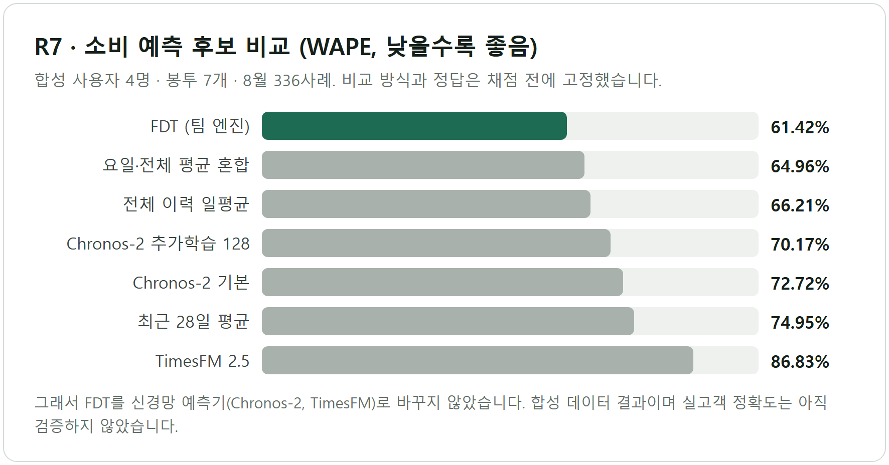

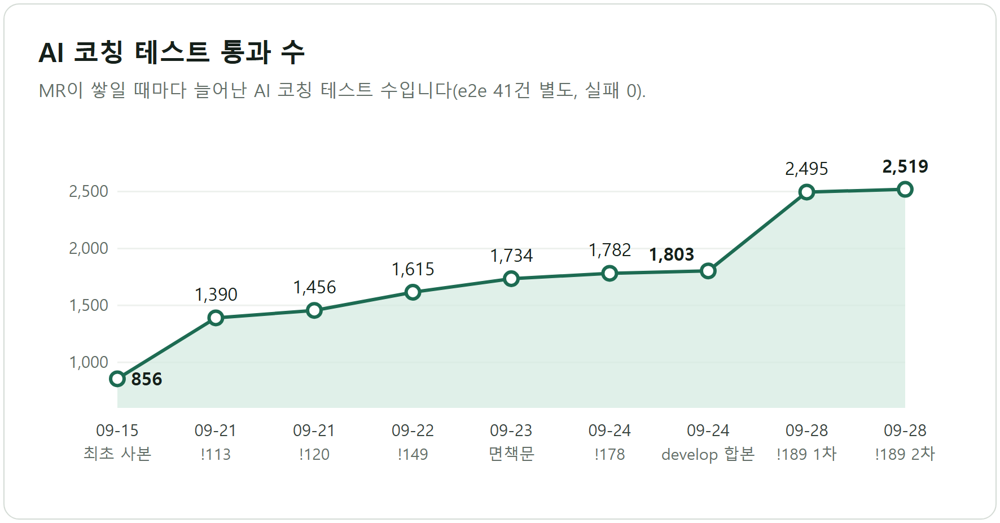

## 한계

- 예측 정확도는 합성 데이터 결과이다. 실제 고객 데이터로는 아직 검증하지 않았다.
- 지연 개선은 엔진(연속 배칭)과 양자화가 함께 바뀐 비교라 둘의 기여를 나누지 않았다.
- 남은 오답에는 "매주?"처럼 맥락 없이는 사람도 뜻을 정할 수 없는 한두 단어 질문이 섞여 있다.
- CI가 `ai/`를 배포하지 않아, 병합 뒤 팀이 코칭 이미지를 다시 빌드하고 라이브로 확인해야 반영된다. 이 과정을 "완료" 조건으로 정해 두었다.

## 배운 점

AI 기능의 신뢰는 모델 크기보다 역할을 어디까지 맡기느냐에서 정해졌다. 숫자는 코드가, 말투와 분류는 모델이 맡게 나누자 모델을 바꾸거나 프롬프트를 고쳐도 금융 수치는 흔들리지 않았다. 검증도 같은 원칙을 따랐다. 시뮬레이터는 모델을 가정으로 두고 나머지 코드를 재고, 실측은 모델 품질을 재고, 재생 검증이 둘을 이었다.

## 링크

- 팀 프로젝트 저장소(공개): https://github.com/tttksj404/KeyFin — `ai/` 폴더가 본인 담당 코드이다.
- 설계·실험·검증 상세 기록(케이스북, 구현 전체 기록)은 비공개 저장소에 있으며 요청 시 공유한다.
