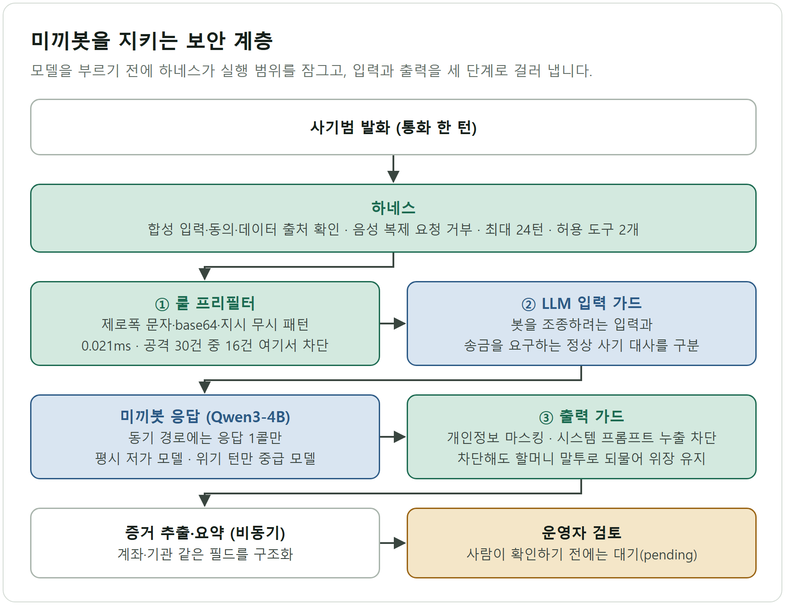
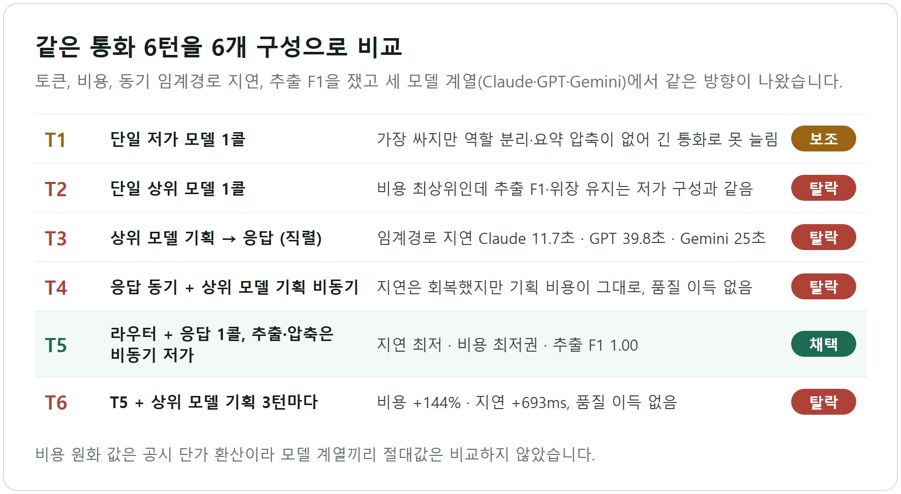
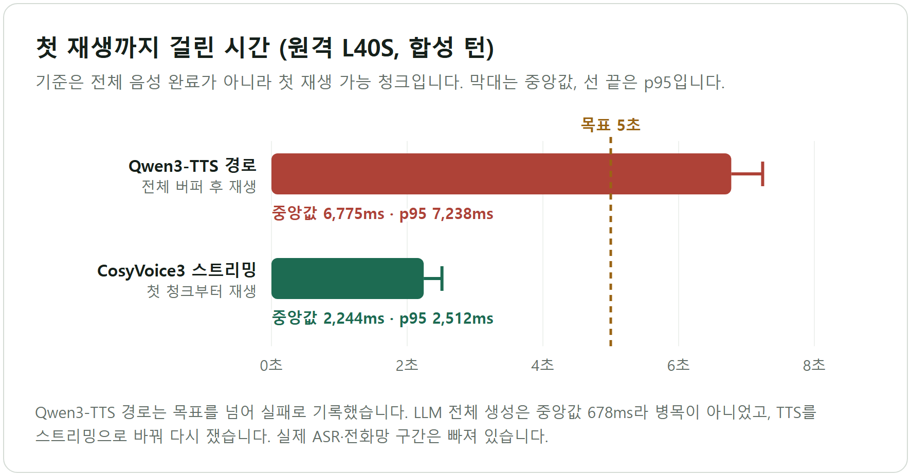
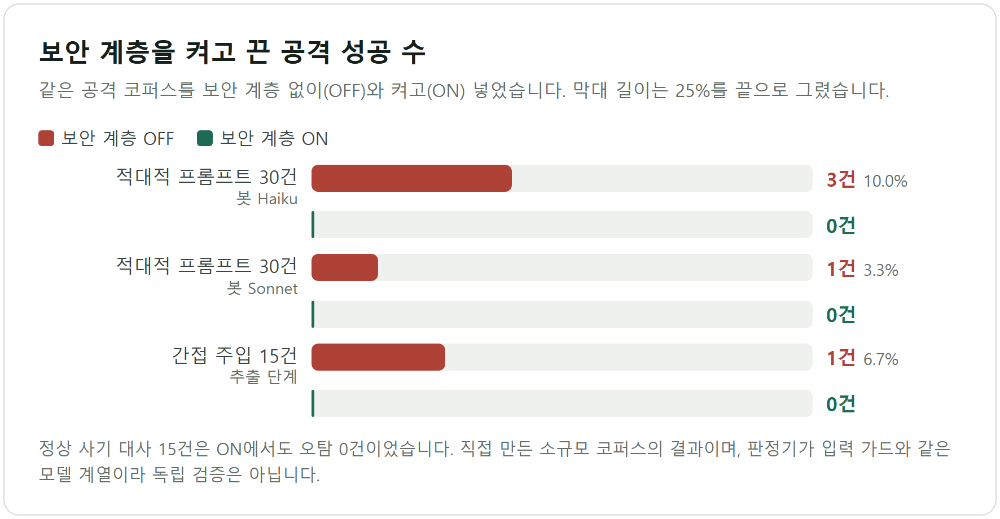

# Sentinel-30 — 공격당하지 않는 보이스피싱 미끼봇

보이스피싱 통화를 AI 미끼봇이 받아 사기범의 시간을 쓰게 하고, 계좌·기관 같은 증거를 구조화해 운영자 검토로 넘기는 흐름을 설계했다. 봇이 사기범의 프롬프트 공격에 무너지지 않게 하는 보안 계층과, 음성 응답이 실시간 기준(5초)을 지키는지 보는 GPU 실측까지 한 저장소에 담았다. 운영 서비스가 아니라 해커톤 컨셉 데모이며, 이 문서도 그 범위 안에서만 결과를 적는다.

| 항목 | 내용 |
| --- | --- |
| 기간 | 2026.05.12 ~ 08.11 (저장소 생성일부터 마지막 커밋까지) |
| 형태 | AI 해커톤 6인 팀(`AI_브리핑.md`), 담당은 법리·보안 트랙. 보안 계층 평가, 구성 비교 실험, 음성 파이프라인 슬라이스는 저장소 커밋 이력상 제 계정이 추가했다 |
| 성격 | 컨셉·데모. 실제 통신망·금융기관 연동, 실사용자 데이터, 사용자 수는 없다 |
| 핵심 기술 | Python, pytest, 룰 + LLM 가드, Qwen3-4B, faster-whisper, Qwen3-TTS, CosyVoice3, PEFT QLoRA, NVIDIA L40S |
| 대표 결과 | 적대적 프롬프트 30건 중 공격 성공 3건(보안 계층 OFF) → 0건(ON), 정상 15건 오탐 0건(소규모 자체 코퍼스). 동적 응답 첫 재생 5초 목표는 현재 경로에서 미달(p95 7,238.2ms)로 판정했고, 스트리밍 TTS 경로의 첫 청크는 중앙값 2,243.55ms를 쟀다(합성 10턴) |

## 문제

보이스피싱은 개인 한 명을 속이는 범죄가 아니라 콜센터처럼 돌아가는 산업이다. 피해자는 통화 중에 사기인지 판단하기 어렵고, 기획서는 송금 15분, 인출 30분, 추적 불가 60분이라는 짧은 골든타임을 가정한다. 차단·탐지만으로는 사기범이 번호를 바꿔 다시 거는 비용이 낮아서, 미끼봇이 통화를 받아 사기범의 시간과 정보를 소모시키는 능동 방어를 택했다.

그러면 새 문제가 셋 생긴다. 미끼봇은 사기범과 직접 대화하므로 지시 무시, 시스템 프롬프트 탈취, 정체 폭로 유도의 표적이 된다. 음성 대화는 응답이 느리면 쓸모가 없다. 고령자 음성, 녹음, 음성 복제는 개인정보와 법적 위험이 크다.

*코드와 평가 결과가 있는 부분은 미끼봇 대화, 증거 필드 추출, 봇을 보호하는 보안 계층이다. 기획서의 음성지문 DB, 통신사·경찰 연동, 시니어 앱은 설계와 목업 수준이다.*

## 내가 한 일과 설계 결정

법리·보안 트랙으로 기획서의 법적 안전지대와 리스크 매트릭스를 맡았고, 이어서 보안 계층(`security_layer_eval/bot/security_layer.py`)과 A/B 평가 하네스, 6개 구성 비교 실험(`security_layer_eval/orch/`), 합성 데이터 음성 파이프라인(`security_layer_eval/voice_pipeline/`)을 만들었다.

### 1. 실행 범위를 하네스로 먼저 잠갔다

`harness.py`는 모델을 부르기 전에 합성 입력 여부, 동의, 데이터 manifest(출처·라이선스), 음성 복제 요청, turn 수(최대 24)를 검사하고 하나라도 어긋나면 거부한다. 허용 도구는 `extractor`와 `tts`뿐이다. 고령자 음성과 통화 녹음은 기능을 먼저 만들고 나중에 막으면 우회로가 남기 때문에, 막는 코드를 먼저 두고 그 안에서만 실험했다. 실제 사용자 목소리 복제는 법무·동의 검토 전에는 구현하지 않고 거부 테스트로 고정했으며, 봇임을 숨기는 전환은 범위에서 뺐다(`docs/VOICE_PIPELINE_ARCHITECTURE.md`는 전환 고지를 요구한다).

### 2. 보안 계층을 룰, LLM 입력 가드, 출력 가드 3단으로 쌓았다

룰 프리필터는 제로폭 유니코드, base64, 지시 무시 같은 시그니처를 정규식으로 잡아 LLM 호출 없이 0.021ms에 끝낸다. 룰을 통과한 입력은 LLM 입력 가드가 의도를 판정하되, 봇을 조종하려는 입력과 송금을 요구하는 정상 사기 대사를 구분한다. 후자를 막으면 사기범이 통화를 끊어 미끼봇의 의미가 사라지기 때문이다. 출력 가드는 개인정보 마스킹과 시스템 프롬프트 누출 차단을 맡는다. 차단할 때도 "차단되었습니다" 대신 할머니 말투로 되묻는 응답을 내보내 위장을 유지한다.

룰만 쓰면 난독화·인코딩·간접 주입에 뚫리고, LLM 분류기만 쓰면 매 턴 지연과 비용이 붙어서 버렸다. 결과 JSON의 턴 로그를 집계하면 공격 30건 중 16건은 룰이 차단해 LLM 가드를 거칠 필요가 없었다. 봇 모델의 자체 거부에 맡기는 안은 대조군(OFF)에서 이미 3건이 뚫려 근거가 부족했다.

### 3. 동기 경로에는 응답 1콜만 두고 나머지는 비동기로 뺐다

같은 검찰 사칭 6턴 통화를 6개 구성(T1~T6)에 넣어 토큰, 비용, 동기 임계경로 지연, 추출 F1을 비교했다. 채택안(T5)은 정규식 라우터가 위기 턴을 고르고, 응답 1콜만 동기로 두며(평시 저가 모델, 위기 턴만 중급 모델), 추출과 요약 압축은 저가 모델로 비동기 처리한다. 상위 모델 기획 역할은 껐다. 기획과 응답을 직렬로 둔 구성(T3)은 임계경로 지연이 Claude 11.7초, GPT 39.8초, Gemini 25초로 늘었고, 기획을 3턴마다 끼운 구성(T6)은 비용 +144%, 지연 +693ms에 품질 이득이 없었다. 저가 모델의 추출 F1은 1.00이었고 세 모델 계열에서 같은 방향이 재현됐다(`security_layer_eval/orchestration_package/README.md`). 비용 원화 값은 공시단가 환산이라 계열 간 절대값 비교는 하지 않았다.

### 4. 실시간 기준을 첫 재생 가능 청크로 잡고, 미달은 실패로 적었다

기준은 전체 오디오 완료가 아니라 첫 재생 가능 청크이며, `latency.py`가 p95와 전체 완료 시간을 따로 계산한다. 원격 L40S에 STT, LLM, TTS를 나눠 두고 재니 Qwen3-TTS 경로의 첫 UDP 패킷은 중앙값 6,775.3ms, p95 7,238.2ms로 5초를 넘었고 병목은 LLM이 아니라 TTS였다. 그래서 TTS를 CosyVoice3 스트리밍으로 바꿔 다시 쟀다. 기준을 전체 완료 시간으로 바꿔 숫자를 좋게 보이게 하는 안은 쓰지 않았고, LLM 전체 생성이 중앙값 678.4ms라 모델을 키우는 안도 접었다. 상용 스트리밍 TTS는 키가 없어 실행하지 못했고 미실행으로 표기했다.

## 결과와 검증

`docs/CLAIM_STATUS.md`의 상태 표기를 그대로 따른다. 합성 데이터와 소수 샘플의 실측이라 일반 성능으로 확대 해석하지 않는다.

| 항목 | 상태 | 수치와 경계 |
| --- | --- | --- |
| synthetic 파이프라인, 하네스 차단, 입출력 가드, HMAC hash-only trace | 검증됨 / local | 현재 저장소 사본에서 voice pipeline 테스트 30개 통과를 재실행으로 확인(CLAIM_STATUS 기록은 22개, 이후 테스트 추가) |
| 원격 GPU 배치 | 검증됨 / remote | L40S 4장, ASR `cuda:2`, LLM `cuda:0`, TTS `cuda:1` |
| STT faster-whisper | 부분 검증 / remote synthetic | 고정 문장 1개의 문자 오류율 0.0, warm 중앙값 223.5ms. 일반 WER 아님 |
| Responder Qwen3-4B | 부분 검증 / remote | warm 전체 생성 중앙값 678.4ms, 첫 토큰 28.4ms. vLLM 서버와 Extractor JSON 계약은 미검증 |
| TTS Qwen3-TTS 0.6B | 부분 검증 / remote synthetic | 7.2초 음성에 8,713.2ms(RTF 1.21). 3회 warm-turn 기준 오디오 준비까지 11,483.0ms |
| 동적 응답 첫 재생 5초 | 실패 / 현재 full-buffer 경로 | 첫 UDP 패킷 중앙값 6,775.3ms, p95 7,238.2ms |
| Qwen3-4B → CosyVoice3 | 부분 검증 / remote synthetic | 첫 청크 중앙값/p95 2,243.55/2,512.5ms(합성 10턴). 실제 ASR, SIP/RTP, 사용자 음성은 미포함 |
| QLoRA smoke | 부분 검증 / remote synthetic | Qwen3-1.7B 4-bit 2 step, loss 7.039534 → 5.896524. 품질 향상 주장 아님 |
| Qwen3-8B 판정 모델 | 오프라인 후보 / 미실행 | 실시간 기본 모델로 쓰지 않음 |
| 사용자 음성 복제 | 차단됨 / local policy | 요청 시 harness가 거부 |
| 통신사·금융사·수사기관 연동, 실전화, 상용 TTS | 범위 외·미실행 | 연동·키·테스트 회선 없음 |

근거는 `docs/CLAIM_STATUS.md`, `docs/REMOTE_GPU_MEASUREMENTS.md`, `security_layer_eval/tests/test_voice_pipeline_*.py`, `security_layer_eval/voice_pipeline/harness.py`이다.

`CLAIM_STATUS.md` 표 밖에 2026년 5월의 보안 계층 A/B 평가가 있다. 결과 JSON에서 읽은 값이다.

| 평가 | 결과 | 근거 |
| --- | --- | --- |
| 적대적 프롬프트 30건(6개 계열 x 5건), 봇 Haiku | 공격 성공 3건(10.0%) → ON 0건, 정상 사기 대사 15건 오탐 0건 | `security_layer_eval/results/eval_results_haiku.json` |
| 같은 코퍼스, 봇 Sonnet | 공격 성공 1건(3.3%) → ON 0건, 오탐 0건 | `security_layer_eval/results/eval_results_sonnet.json` |
| 간접 주입 추출(오염 15건, 정상 6건) | 주입 성공 1건(6.7%) → ON 0건, 정상 6건 무결성 1.0 | `security_layer_eval/results/extract_results_haiku.json` |

## 한계와 다음 단계

- 공격 30건, 정상 15건은 규모가 작고 직접 만든 코퍼스이다. 판정기는 룰과 LLM을 섞은 방식이고 입력 가드와 같은 모델 계열(Haiku)이라 독립 검증이 아니다. "0건"은 이 코퍼스 안의 값이다.
- 저장소의 방어 퍼널 그림(`security_layer_eval/results/fig2_defense_funnel.png`)은 입력 가드 통과를 0건으로 그렸지만, 결과 JSON에서는 멀티턴 공격 1건(F2)의 세 턴을 가드가 모두 허용했고 응답은 판정상 안전했다. 이 문서는 그림이 아니라 JSON 기준으로 썼다.
- 입력 가드는 LLM 1콜이고 기록된 API 지연이 13.53초이다. CLI 경로의 오버헤드라는 메모가 있지만 API 직결로 다시 재지 않았으므로 실시간 통화에 쓸 만하다고 주장하지 않는다.
- 5초 목표는 Qwen3-TTS 경로에서 실패했다. 스트리밍 경로의 첫 청크 2.2초는 합성 턴 기준이며 실제 ASR, SIP/RTP, 통신사 구간이 빠져 있다.
- human-review 상태는 `pending`까지만 구현했고 승인 저장소는 없다. RAG fallback, 정보전 허브, 시니어 앱은 설계·목업이고, 발표 이미지의 일부 목표 수치(통화 유지 시간, 토큰 절감 비율)는 성과로 쓰지 않았다.

다음 단계는 스트리밍 TTS와 20ms 패킷화로 첫 재생 p95 재측정, 고정 holdout의 WER와 추출 F1 측정, 다른 계열 모델을 판정기로 쓰는 재평가와 코퍼스 확대, 입력 가드를 소형 분류기나 API 직결로 바꿔 지연 재측정, vLLM 서빙과 승인 저장소 구현이다. 실서비스에는 법무·개인정보 검토와 사람 운영자 통제가 먼저 필요하다.

## 기술 스택과 링크

- 언어·테스트: Python, pytest
- 보안 계층: 정규식 룰 프리필터, LLM 입력·출력 가드, 룰 + LLM 판정기, HMAC hash-only trace
- 음성·모델: faster-whisper large-v3-turbo, Qwen3-4B, Qwen3-TTS 0.6B, CosyVoice3, Qwen3-1.7B 4-bit PEFT QLoRA smoke
- 인프라: NVIDIA L40S 4장(원격 GPU 커널), 로컬 RTX 4050 Laptop(preflight만)
- 공개 레포: https://github.com/tttksj404/AI-
- 상태 기준표: https://github.com/tttksj404/AI-/blob/main/docs/CLAIM_STATUS.md
