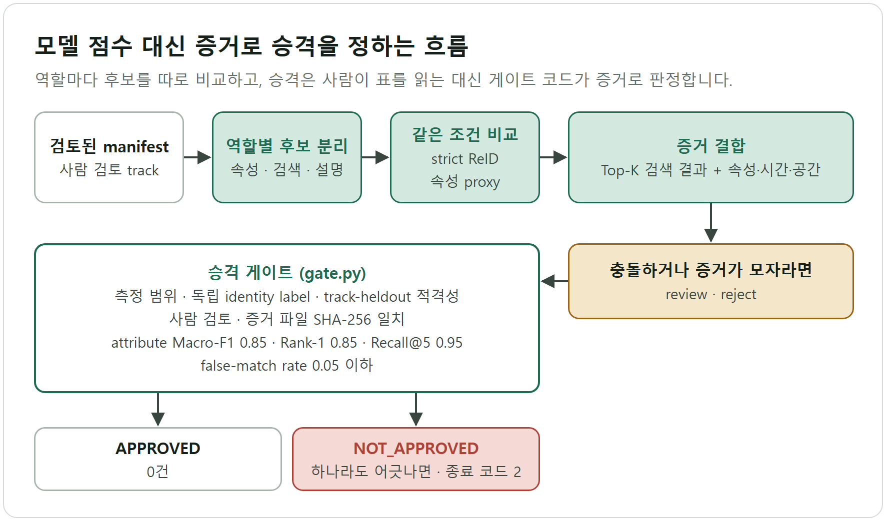
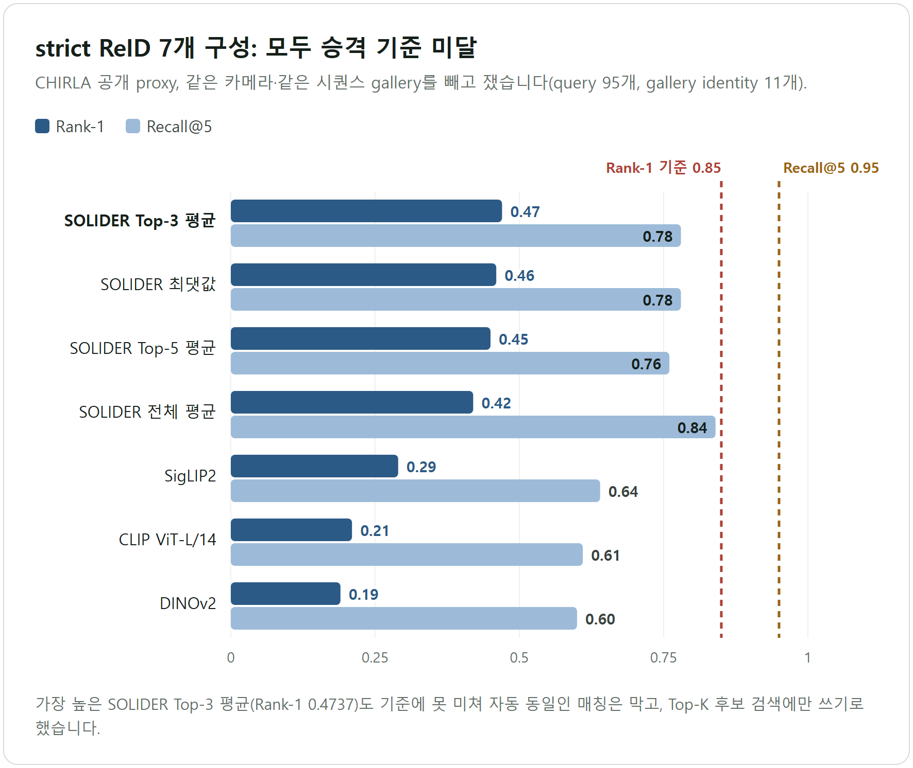
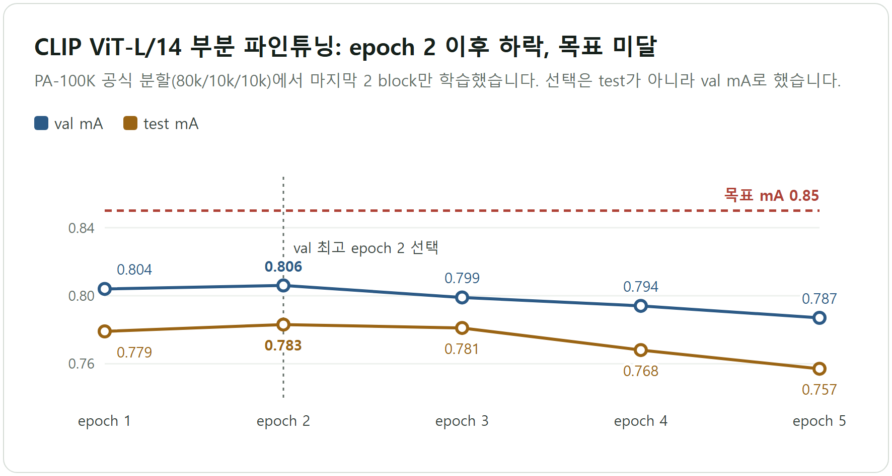

# CCTV 후보 모델 선정 실험과 승격 게이트

> 모델 점수 하나를 고르는 대신, 역할별로 후보를 나누고 증거 조건을 통과한 결과만 다음 단계로 넘기는 절차를 실험과 코드로 만들었다. 2026년 8월 14일 기준으로 승격 기준을 통과한 후보는 없고, gate는 그 사실을 `NOT_APPROVED`로 기록한다.

## 한눈에 보기

| 항목 | 내용 |
| --- | --- |
| 기간 | 2026년 7월 하순 ~ 8월 중순 (실험 결과 파일 7월 23일 ~ 8월 10일, 공개 커밋 7월 30일 ~ 8월 14일, 10월 6일 그림 파일 복구 커밋 제외) |
| 형태 | AIoT 팀 프로젝트(단일 CCTV 위험관제 MVP)의 AI 파트. 이 저장소의 범위는 후보 모델 비교 실험, 평가 프로토콜, 승격 gate 코드, 실험 자산 보존이다. 엣지 장치, 이벤트 백엔드, 대시보드는 포함하지 않는다. |
| 핵심 기술 | SOLIDER Swin-B(속성 PAR, ReID), CLIP ViT-L/14 파인튜닝·지식 증류, strict ReID 평가, SHA-256으로 증거 파일을 다시 검증하는 Python gate |
| 대표 결과 | strict ReID 최고 구성(SOLIDER Top-3 평균)이 Rank-1 0.4737, Recall@5 0.7789로 자동 매칭 기준(0.85, 0.95)에 못 미쳤다. 자동 동일인 매칭은 `BLOCKED`, Top-K 후보 검색에만 허용했다. proxy 점수만 있는 후보는 gate가 `NOT_APPROVED`(종료 코드 2)로 막고, 단위 테스트 6개가 통과한다(직접 재실행). |

## 문제

- **동일인 자동 확정이 위험하다.** 카메라와 시간이 바뀌면 조명, 각도, 가림이 달라진다. 오매칭 하나가 이후 위험 판정의 맥락을 오염시키므로 자동 확정과 후보 제시를 나눠야 했다.
- **프로젝트 CCTV의 정답이 부족하다.** 사람이 검토한 안정 track은 10개뿐이고 identity는 각 원본 track 안에서만 유효하다. 교차 카메라 identity 정답은 없다.
- **공개 벤치마크 점수가 현장 성능처럼 읽힌다.** PA-100K(속성)와 CHIRLA(ReID)는 과제가 다른 proxy다. 같은 카메라·같은 영상에서 query와 gallery를 뽑으면 점수가 부풀고 모델 차이도 가려진다.
- **모델마다 출력과 비용이 다르다.** 팀의 확정 구조는 엣지 YOLO 1차 검출 뒤에 Jetson의 학생 CLIP이 조건을 충족한 프레임만 판정하는 형태다. 속성, 동일인 검색, 설명 생성을 어느 모델에 맡길지 정해야 했다.

## 내가 한 일과 설계 결정

AI 파트에서 네 가지를 맡았다. 속성(CLIP 파인튜닝, SOLIDER PA head, 지식 증류)과 동일인 검색(SOLIDER ReID, CLIP, SigLIP2, DINOv2)의 후보 비교 실험, `identityGroupId`·`cameraId`·`trackId`·사람 검토·teacher provenance를 필수 항목으로 고정한 strict 평가 계약, 승격 gate(`src/cctv_eval_harness/gate.py`)와 단위 테스트, 그리고 GPU 서버 초기화 전 실험 자산 보존이다. 보존 범위는 8,949개 파일(5.889 GiB)의 크기·SHA-256 검증, 선택 가중치 10개(2.371 GiB)의 Git LFS 보관, 서버 전체 모델 198개(305.813 GiB)의 목록·크기·경로 기록이다.

**모델 하나에 맡기지 않고 역할로 나눴다.** 임베디드 1차 후보(`student_CLIP_hard`), 서버 속성(SOLIDER Swin-B + PAR), 동일인 검색(SOLIDER ReID), 생성형 검토(Qwen 계열)를 분리했다. ReID는 runtime에서 Top-K 검색만 허용하고 생성형 모델은 충돌·저신뢰도 설명에만 쓴다. 속성 점수와 ReID 점수는 한 순위표에 합치지 않았다. 버린 대안은 생성형 모델 하나가 전부 맡는 구조다. 출력 공간과 검증 기준이 다른 작업을 묶으면 어느 쪽 오류인지 가를 수 없다. 과거 proxy 비교(45개 person crop)에서도 CLIP ViT-L/14가 속성 점수 0.414, p95 4.141초, Qwen3-VL-2B가 0.393, 8.298초로 생성형이 느리고 앞서지 못했다. 현재 선정 기준이 아니라 참고 근거다(`docs/experiment-decision-log.md`).

**점수가 높게 나오는 평가를 버리고 strict 평가를 기준으로 삼았다.** ReID는 같은 카메라·같은 시퀀스 gallery를 제외하고 쟀다. 같은 카메라와 시퀀스가 섞인 프로젝트 영상 비교(질의 40개, identity 10개)에서는 SOLIDER와 CLIP이 모두 Rank-1 1.0이었다. 두 모델이 같은 만점을 받아 모델을 가르지 못했고 strict 조건도 아니어서 증거로 채택하지 않았다(`gpu-recovery/cctv/clip_vitl14_server/experiments/results/project_cctv_gpu_20260810/`). strict 조건의 CHIRLA 결과는 Rank-1 0.47로 훨씬 낮지만 이 값으로 자동 매칭을 막았다.

**승격 판단을 눈대중이 아니라 코드로 고정했다.** `gate.py`는 측정 범위(`sealed_identity_track_heldout`), 독립 identity label, track-heldout 적격성, 사람 검토, 증거 파일의 SHA-256 일치, 임계값(attribute Macro-F1 0.85, Rank-1 0.85, Recall@5 0.95, false-match rate 0.05 이하) 중 하나라도 어긋나면 `NOT_APPROVED`를 반환한다. workspace 밖을 가리키는 증거 경로도 거부한다. 버린 대안은 노트북 결과 표를 읽고 사람이 판단하는 방식이다. 수치만 보면 통과처럼 보이는 proxy 결과가 증거 없이 올라가는 길을 코드로 막았다.

**측정하지 못한 후보를 0점으로 넣지 않았다.** 실행되지 않은 후보(`invalid_runtime`인 Gemma, `pending`인 Qwen2.5)는 순위에서 제외하고 원인을 남겼다. 0점으로 넣으면 측정해서 나쁜 모델과 측정하지 못한 모델이 섞인다. 학생 모델은 test가 아니라 val mA로 골랐다.

## 결과와 검증

### strict ReID (CHIRLA 공개 proxy, query 95개, gallery identity 11개)

*저장소 결과 JSON 7개의 수치로 다시 그린 그림이다. 모든 막대가 기준선 아래에 있다.*

- 최고 Rank-1은 SOLIDER Top-3 평균의 0.4737(Recall@5 0.7789)이다. SOLIDER 전체 평균은 Recall@5가 0.8421로 더 높지만 Rank-1이 0.4211이어서, Rank-1이 가장 높은 Top-3 평균을 후보 검색기로 골랐다(`.../experiments/results/chirla_solider_official_strict_hflip_*.json`).
- CLIP(Rank-1 0.2105), SigLIP2(0.2947), DINOv2(0.1895)는 SOLIDER보다 낮았다. 95% 신뢰구간은 CLIP(0.14~0.29)과 DINOv2(0.12~0.27)가 SOLIDER Top-3(0.38~0.57)와 겹치지 않고 SigLIP2(0.21~0.39)는 일부 겹친다.
- 별도 manifest(query 107개)의 SOLIDER Top-5 평균도 Rank-1 0.4486, Recall@5 0.8037로 같은 결론이었다(`chirla_identity_heldout_solider_hflip_topk_mean_20260810.json`). ReID 파인튜닝(Arm A)은 8 epoch 동안 검증 지표가 기준선(Rank-1 0.3, 질의 10개)에서 움직이지 않았다(`chirla_solider_ft_arm_a_20260810.json`).

### 속성 proxy (PA-100K 공식 분할 80k/10k/10k, test mA)

*`orchestration_clip_vitl14_finetune_5ep_20260810.json`의 기록으로 다시 그린 그림이다.*

| 실험 | test mA | 판정 |
| --- | ---: | --- |
| CLIP ViT-L/14 마지막 2 block 파인튜닝(val 최고 epoch 2) | 0.7827 | 목표 0.85 미달 |
| SOLIDER Swin-B 고정 + PA head(30 epoch) | 0.7567 (InsF1 0.8584) | 속성 보조 head로 보존 |
| 증류 α=0.15, T=1.5: 증류 학생 / hard 학생 | 0.7256 / 0.7272 | 목표 미달 |
| 증류 α=0.35, T=2.0: 증류 학생 / hard 학생 | 0.7316 / 0.7363 | 목표 미달 |
| 증류 α=0.65, T=3.0: 증류 학생 / hard 학생 | 0.7187 / 0.7363 | 목표 미달 |

증류 세 조합 모두 val mA 기준으로 hard 학생이 선택됐고, 증류 학생의 test mA도 모두 낮았다. α=0.35와 0.65에서는 InsF1이 올랐지만(α=0.65: 0.68 대 0.60) 선택 지표는 mA였다. 그래서 `student_CLIP_hard`가 임베디드 1차 후보로 남았다(`.../experiments/results/*distill*.json`).

### 승인·미승인 판정

| 대상 | 판정 | 근거 |
| --- | --- | --- |
| 자동 동일인 매칭 | `BLOCKED` | Rank-1 0.4737 < 0.85, Recall@5 0.7789 < 0.95 (`configs/model_selection_snapshot.json`) |
| SOLIDER ReID Top-K 후보 검색 | 허용(검색 전용) | runtime에서 retrieval-only 강제 |
| SOLIDER Swin-B + PAR(서버 속성) | 구현 후보, production 미승인 | 속성 proxy만 측정 |
| `student_CLIP_hard`(임베디드) | proxy 우세, production 미승인 | 위 증류 비교 |
| 생성형(Qwen 계열) | 검토 보조 전용 | 판정 권한 없음 |
| 전체 promotion | `NOT_APPROVED` | `productionApproved = false`, runtime `provisional` |

`APPROVED`는 0건이다. `unittest` 6개가 통과하고, `examples/proxy_result.json`을 gate에 넣으면 9개 사유와 함께 `NOT_APPROVED`(종료 코드 2)가 나온다.

## 한계와 다음 단계

- **근거가 모두 공개 proxy다.** PA-100K와 CHIRLA 수치는 프로젝트 CCTV의 일반화 성능이 아니고, 교차 카메라 정답이 없어 현장 수치는 아직 없다.
- **표본이 작다.** gallery identity가 11개라 무작위로 줄 세워도 Recall@5가 약 0.45(5/11)다. Top-3와 Top-5 평균의 Rank-1 차이(0.47, 0.45)는 신뢰구간 안에 들어 구분되지 않는다.
- **false-match rate 측정값이 없다.** gate가 요구하는 항목인데 strict ReID 결과 파일에는 이 값이 없다.
- **수치 한 곳이 어긋난다.** Top-3 평균의 MRR이 스냅샷(0.6074)과 원본 결과 파일(0.6049)에서 다르다. 이 문서는 Rank-1과 Recall@5만 인용했고 저장소 정리는 남은 일이다.
- **엣지 YOLO 단계는 평가하지 않았다.** 저장소의 YOLO 가중치는 AGV 격자 데이터로 학습한 8클래스 모델이며 사람 검출 근거가 아니다. GitHub clone만으로는 학습을 재현할 수 없고, 원본 CCTV와 서버 전체 모델 바이너리는 비공개 복원이 필요하다.

다음 루프는 결정 로그의 순서를 따른다. 동일인을 교차 카메라·이벤트 단위로 독립 검토한 manifest를 만들고 group·track·시간 누수를 검사한다(test split에는 augmentation 금지). 후보 하나만 바꿔 strict ReID와 track 단위 속성 지표를 다시 재고, 사람 검토와 provenance를 포함한 증거를 gate에 넣는다. 통과하지 못하면 수치를 읽고 후보, 규칙, 데이터 계약으로 되돌아간다.

## 기술 스택과 링크

- 언어·실행: Python 3.11, `uv`, `unittest`, Jupyter notebook
- 모델·학습: PyTorch 2.6(CUDA 12.4, NVIDIA L40S), SOLIDER Swin-B(PAR, ReID), CLIP ViT-L/14, SigLIP2, DINOv2, Qwen3-VL(검토 보조 후보)
- 데이터·평가: PA-100K, CHIRLA, Rank-1·Recall@5·mA·InsF1
- 보존·검증: SHA-256 manifest, Git LFS
- 저장소: https://github.com/tttksj404/cctv-model-selection-lab
