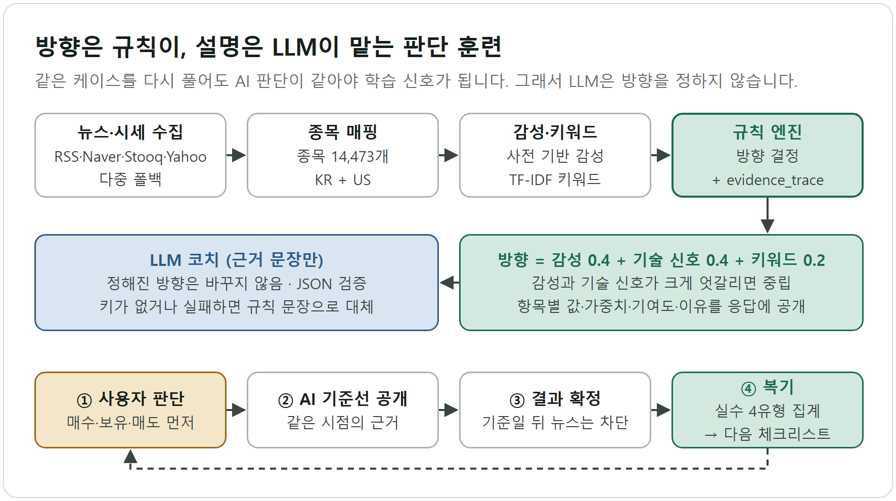
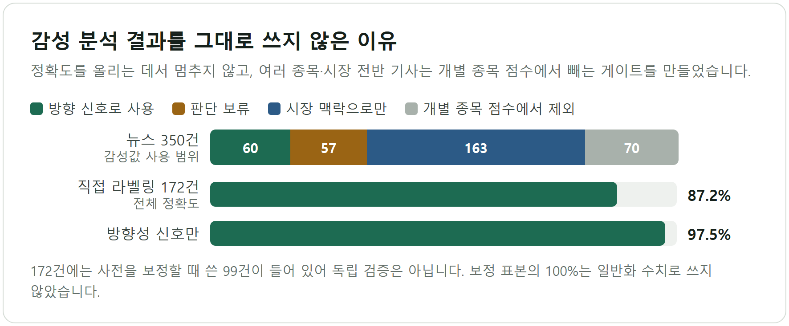

# AntHill(앤트힐) — AI가 정답을 주지 않는 주식 판단 트레이닝 게임

뉴스·차트·기술지표를 보고 사용자가 먼저 판단하고, 같은 시점의 규칙 기반 AI 기준선과 근거를 맞춰 보며 판단 습관을 복기하는 Django 웹 서비스다. 원형은 SSAFY 마지막 관통 프로젝트(StockPulse AI)의 뉴스 분석 파이프라인이다.

## 한눈에 보기

| 항목 | 내용 |
|---|---|
| 기간 | 2026-05-08 ~ 2026-07-04 (원형 5/8~6/5, AntHill 6/5~7/4. 저장소 생성일·마지막 푸시 기준) |
| 형태 | 개인 중심. 원형 저장소는 단독 커밋 7건. AntHill는 커밋 156건 중 140건을 직접 작성했고, 협업자 1명이 성능 개선·Render 배포 준비·훈련 라운드 개선 16건을 맡았다. |
| 내 역할 | 기획, 뉴스 수집·점수 파이프라인, AI 기준선 엔진, LLM 연동, 훈련·복기 화면, 테스트, 고지 문구 |
| 핵심 기술 | Python · Django 5.2 · DRF + SimpleJWT(HttpOnly 쿠키) · OpenRouter LLM(DeepSeek V4 Flash) · Canvas 2D 자작 차트 · Playwright |
| 대표 결과 | 규칙 엔진이 방향을 정하고 LLM은 근거 문장만 쓰는 3계층 구조 · 점수마다 `evidence_trace` 공개 · API 키 없이도 전체 흐름 동작 · 직접 라벨링한 뉴스 172건에서 감성 정확도 87.2%(보정 표본 포함) |

## 문제

"AI가 오를 종목을 알려준다"는 서비스는 사용자의 판단력을 키우지 못한다. 사용자는 결론만 받고, 틀렸을 때 어떤 근거를 놓쳤는지 복기할 재료가 없다. 금융 서비스에서는 매매 권유 표현이 자문업 규제 문제로 번지기도 한다.

원형 프로젝트의 회고에 이미 이 결론이 있다. "AI 주식 추천"으로 출발했지만 핵심은 사용자의 판단을 돕는 일이었다. AntHill는 그 결론을 제품 구조로 옮겼다. 사용자가 매수·보유·매도 관점을 먼저 고르고, AI 기준선과 근거를 본 뒤, 결과가 확정되면 놓친 근거를 유형별로 복기한다. 목적은 승패가 아니라 근거 비교다.

## 내가 한 일과 설계 결정

원형에서는 RSS·Naver 뉴스 수집, 종목 사전 매핑, 사전 기반 감성 분류, TF-IDF 키워드 추출, 관심종목 순위 API를 만들었다. AntHill에서는 그 위에 판단 엔진, 훈련 게임, 복기 루프, 안전 장치를 얹었다.

**1. 방향은 규칙이, 설명은 LLM이 맡는다.** 분석·실시간 판단 화면의 AI 방향은 `decision_for_scores`가 뉴스 감성 0.4, 기술 신호 0.4, 키워드 선명도 0.2를 가중합해 정한다. 감성과 기술 신호가 극단적으로 엇갈리면(70 이상 대 35 이하) 중립으로 둔다. 훈련 게임의 라운드별 AI 판단은 브라우저의 `aiActionForPoint`가 케이스 라벨, MACD, 20일선, RSI 구간으로 따로 계산한다. 두 경로 모두 LLM에 방향을 맡기지 않았다. 같은 케이스를 두 번 풀었는데 AI 판단이 달라지면 학습 신호가 깨지기 때문이다. `llm_judge_chart`는 정해진 방향을 프롬프트에 넣고 "방향은 바꾸지 말고 근거만 설명하라"고 지시한다. 응답은 JSON으로 검증하고, 키가 없거나 호출·파싱이 실패하면 규칙 기반 문장으로 대체한다. 호출은 배치 단계의 상위 12개 종목으로 제한해 비용을 묶었다.

**2. 점수마다 근거를 남긴다.** 이슈 강도(뉴스량 0.3, 감성 극성 0.3, 키워드 0.2, 기술 신호 0.2)와 방향 판단 모두 항목별 `value`·`weight`·`contribution`·`reason`을 JSON으로 저장해 API 응답에 붙인다. "왜 이 종목이 TOP에 떴나"가 화면과 데이터에 그대로 드러난다.

**3. 결과를 미리 보여주지 않는 훈련 설계.** 과거 훈련 케이스는 기준일 이후의 뉴스를 잘라내고 제출 전에는 결과를 숨긴다. 기준일 이후 기사를 일부러 심어 근거에 섞이지 않는지 확인하는 테스트를 작성했다(지금은 케이스 생성 단계 오류로 통과하지 못하며, 아래 한계에 적었다). 사용자와 AI 기준선은 같은 결과에 가상 비중(AI는 긍정 50%·중립 20%·부정 0%)을 적용해 비교한다. 복기는 실수를 네 유형(가격 선반영, 리스크 누락, 뉴스 과신, 차트 무시)으로 집계해 다음 체크리스트 순서에 반영한다. 미래 캔들 가리기, 인덱스 등간격 축, AI 판단 마커 공개 연출이 필요해서 Canvas 2D 차트는 직접 작성했다.

**4. 책임 있는 표현과 최소 보안 가드.** `/disclosures/`에 "투자 자문이 아니다", "AI 기준은 정답이 아니다"와 데이터 지연·오류 가능성을 명시했다. 신고·검토 절차가 없는 커뮤니티 기능은 운영 설정(`DEBUG=0`, `render.yaml`)에서 꺼 둔다. 인증은 HttpOnly 쿠키와 CSRF 검증을 쓰고, 데모 버튼은 브라우저별 일회용 계정을 발급한다. 뉴스 수집 API는 관리자 전용이며 실행 중인 작업의 중복 요청을 거부한다.

## 결과와 검증

| 항목 | 결과 | 근거 |
|---|---|---|
| 자동 테스트 | 테스트 111개 정의. 외부 네트워크를 차단한 로컬 실행(Windows, CI와 같은 `DJANGO_DEBUG=1`)에서 101개 통과, 10개 실패 | `pulse/tests.py` |
| 감성 분류 | 직접 라벨링 172건 평가, 전체 정확도 87.21%, 방향성 신호만 보면 97.52% | `data/runs/20260515T050306Z/review/expanded_labeling_validation_report.md` (원형) |
| 감성값 사용 제한 | 뉴스 350건 중 방향 신호 60건, 판단 보류 57건, 시장 맥락용 163건, 개별 점수 제외 70건 | `data/runs/20260515T050306Z/review/remaining_risk_closure_report.md` (원형) |
| 안전 동작 | HttpOnly 쿠키, CSRF 필수, 데모 계정 격리, 수집 작업 중복 거부 테스트는 같은 로컬 실행에서 통과. 미래 뉴스 차단 테스트는 훈련 케이스가 생성되지 않아 오류가 났고 원인 확인 전이다. | `pulse/tests.py` |
| 데이터 규모 | 종목 14,473개(KR 3,745 + US 10,728), 카테고리 규칙으로 약 73% 명시 분류 | `README.md` |

감성 정확도는 읽을 때 주의가 필요하다. 라벨 99건으로 사전을 보정하자 그 99건에서 100%가 나왔지만 보정에 쓴 표본이라 일반화 수치로 쓰지 않는다(원형의 `sentiment_accuracy_improvement_report.md`). 172건에도 그 99건이 들어 있어 독립 검증은 아니다. 그래서 정확도를 올리는 데서 멈추지 않고, 다중 종목·시장 전반 기사의 감성은 개별 종목 점수에서 빼는 게이트를 따로 만들었다.

원형 화면의 키워드에는 "언급했다", "나왔다" 같은 서술어가 섞여 있다. AntHill의 `tokenize`에는 서술어 어미로 끝나는 토큰을 버리는 필터가 들어갔다.

## 한계와 다음 단계

- **수익을 말하지 않는다.** 사용자와 AI의 비교 성과는 훈련 케이스에 가상 비중을 곱한 학습용 수치다. AI 기준선의 적중률은 재지 않았고 투자 성과를 주장하지 않는다.
- **훈련 AI 기준의 시점 처리가 남은 과제다.** 훈련 케이스의 AI 방향이 최신 이슈 분석의 감성 라벨을 가져와 쓰는 경로가 있어(`seed.py`의 `historical_training_snapshot`), 기준일 이후 정보가 섞였을 수 있다. 서버의 가중합 방향과도 경로가 둘로 나뉘어 있다. 기준일까지의 데이터로 방향을 다시 계산하고 두 경로를 하나로 합치는 일이 첫 과제다.
- **테스트가 모두 통과하지는 않는다.** 로컬에서 111개 중 101개가 통과하고 GitHub Actions의 테스트 단계도 실패 중이다. CI 설정(`DJANGO_DEBUG=1`)에서 기능 플래그 기본값이 바뀌는 문제, 실행일에 묶인 단언, Windows 임시 파일 권한까지는 원인을 확인했다. 외부 호출 mock 격리와 플래그 고정이 다음 작업이다.
- **판단 근거가 단순하다.** 0.4 / 0.4 / 0.2 가중치는 경험값이고 민감도 검증을 하지 않았다. 감성 분석은 단어 사전 방식이라 반어와 가격 선반영을 놓친다. 키가 없는 데모에 보이는 LLM 근거 5건은 시드에 넣어 둔 예시 문장이다.
- **실서비스 전 조건이 남았다.** "추격 매수 보류" 같은 표현은 유사투자자문업 해당 여부를 검토해 정리해야 한다(`docs/PORTFOLIO_READINESS.md`). 시세·뉴스는 SLA 없는 무료 API에 의존하고 DB는 SQLite 기본이라 다중 사용자 부하는 검증하지 않았다.

## 기술 스택

| 영역 | 사용 기술 |
|---|---|
| 백엔드·데이터 | Python, Django 5.2, DRF 3.17, SimpleJWT 5.5, SQLite / PostgreSQL, JSONField |
| 수집·AI | Google News RSS · Naver · Stooq · Yahoo Finance(다중 폴백), TF-IDF, 규칙 점수 엔진, OpenRouter 경유 DeepSeek V4 Flash(근거 문장 전용) |
| 프론트엔드 | Django Templates, Vanilla JS, Canvas 2D 자작 차트, Pretendard |
| 배포·검증 | Gunicorn, WhiteNoise, Docker, Render 설정, GitHub Actions, Playwright, Codex·Figma MCP 병행(레포의 `progress.md` 기준) |

코드 저장소는 비공개이며 요청 시 공유한다.
