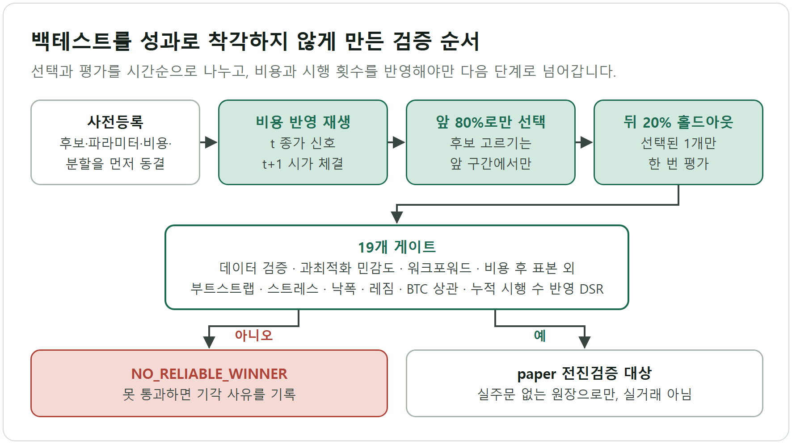
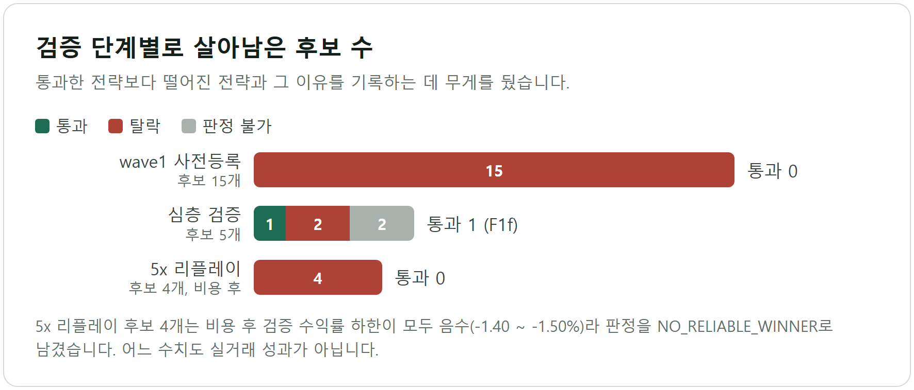

# Strategy Arena: 백테스트 결과를 성과로 착각하지 않게 만드는 검증 설계

> Binance 공개 시세로 전략을 조립해 백테스트하는 웹 빌더를 만들고, 그 위에 비용 반영, 사전등록, 시간순 홀드아웃, 다중검정 보정을 얹었다. 통과한 전략보다 탈락한 전략을 근거와 함께 기록하는 데 무게를 뒀다. 실거래 시스템이 아니며 투자 조언도 아니다.

## 1. 한눈에 보기

| 항목 | 내용 |
|---|---|
| 기간 | 2026-07-15 ~ 2026-08-24 (커밋 기록 기준, 96건) |
| 형태 | 개인 프로젝트, 공개 레포. 시뮬레이션·연구 전용이며 주문 기능이 없다 |
| 핵심 기술 | Python, Flask, NumPy, pandas, pytest. 지표 조합형 백테스트 엔진, 사전등록과 시간순 분할 검증, 19개 게이트 |
| 대표 결과 | 5x 리플레이에서 사전등록 후보 4개가 모두 비용 후 검증 수익률 하한이 음수여서 판정은 `NO_RELIABLE_WINNER`. 데이터 절단 버그를 찾아 교정했고 수치는 전부 하향됐다 |

## 2. 문제: 백테스트 곡선은 쉽게 성과로 읽힌다

설정을 바꿔 돌리면 곡선은 대개 우상향으로 나온다. 이 레포에서 실제로 마주친 오해 경로는 네 가지다.

- **같은 구간에서 고르고 평가한다.** 유전 알고리즘이 고른 모멘텀 개체는 전기간 CAGR이 133.9%였으나 표본 외 적합도는 음수였고, 최대낙폭은 71.6%(표본 외)~91.5%(학습), 단일 최대손실은 원금의 82.3%였다.
- **많이 시도한 뒤 최고만 본다.** 후보 G1은 누적 시행 7,621회를 보정하자 DSR(Deflated Sharpe Ratio)이 -0.760으로 떨어졌다.
- **소수 거래가 성과를 만든다.** 어느 후보는 99거래 중 상위 5거래를 빼면 -93.8%였다.
- **데이터가 조용히 틀린다.** 스팟 시세 수집이 중간에 끊겼는데도 모든 내부 정합성 검사를 통과했다.

## 3. 내가 한 일과 설계 결정

빌더는 Flask 앱(`app.py`)과 계산 엔진(`engine.py`)으로 나뉜다. 엔진에는 신호 12종, 필터 8종, 리스크 6종, 사이징 4종이 있고, 브라우저가 Binance 공개 시세를 받아 서버로 보내면 서버가 백테스트만 계산한다. 연구 쪽은 `research/` 아래 wave1~wave32 단계와 `bitget_5x` 패키지로 구성했다.

**1. 체결 규칙과 비용을 엔진에 고정했다.** 신호는 바 종가에 계산하고 다음 바 시가에 체결한다. 수수료와 슬리피지는 진입과 청산 양쪽에 매기며 기본값은 0.075%와 0.05%다. 시가 갭이 손절선·익절선을 넘으면 선 가격이 아니라 시가에 체결한다. 한 바에서 두 선이 함께 닿으면 시가에서 가까운 쪽이 먼저 닿았다고 가정한다. 거래가 30건 미만이면 결과에 경고를 붙인다. 연구 쪽 비용은 `research/wave1/SPEC.md`에 퍼프 테이커 0.06%, 현물 테이커 0.10%, 슬리피지 1~5bp로 적었고, 슬리피지를 2배로 올린 스트레스 재실행을 필수로 뒀다. "종가 신호는 다음 시가에 체결"은 `test_no_lookahead.py`가 단위 테스트로 지킨다.

**2. 선택과 평가를 분리했다.** wave1은 후보 15개를 2026-07-15에 동결하고 사후 추가를 금지했다. 표본 외 구간(2025-10-01~2026-07-14)은 후보당 한 번만 읽는다. `bitget_5x`는 시간순 앞 80%로만 후보를 고르고, 뒤 20%는 선택된 한 후보에만 열어 판정한다. 검증 80건, 홀드아웃 20건에 못 미치면 통과가 아니라 `NO_RELIABLE_WINNER`로 처리한다.

**3. 시행 횟수를 세어 유의성을 깎았다.** 후보마다 19개 게이트(데이터 검증, 과최적화 민감도, 워크포워드, 비용 후 표본 외, 부트스트랩, 스트레스, 낙폭, 레짐, BTC 상관 등)의 PASS·FAIL·UNDETERMINED 표를 남긴다. DSR에는 누적 시행 수를 넣었고 wave별로 7,621, 22,621, 82,621회가 쌓였다. 캐시가 모자라는 항목은 통과로 두지 않는다(`DEEP_REPORT.md`). 앞 단계 보고가 틀렸을 때는 정정을 명시했다. wave-21의 DSR 0.236이 G1이 아니라 유전 알고리즘 원본의 수치였다는 사실을 wave-22에서 바로잡은 것이 한 예다.

**4. 연구 결과와 실거래 주장을 구조로 분리했다.** `docs/RESEARCH_GUARDRAILS.md`는 기록할 입력(데이터 출처, 분할, 비용, 설정)을 계약으로 못박고, 이 입력이 없는 결과는 탐색 수준으로만 쓰게 한다. 결과 JSON에는 `mode: historical_research_only`, `execution: disabled`가 들어간다. `bitget_5x` 어댑터는 공개 시세 조회만 하며 주문·계정 경로가 없다는 점을 테스트가 확인한다. 공개 레포에서 뺀 실행·자격증명 경로는 `docs/COIN_CONSOLIDATION_2026-08-24.md`에 목록으로 남겼다. 전진 검증은 실주문 없는 paper 원장(`research/paper/`)으로만 돌리며, 후보가 요구 유니버스(100종목)를 못 채운 채 매일 "현금"만 기록한 사고를 겪은 뒤 유니버스 충족 검사를 붙였다.

## 4. 결과와 검증

| 항목 | 결과 | 근거 |
|---|---|---|
| 5x 리플레이 (30일, 4개 계약, 거래량 필터 4개) | 4개 모두 비용 후 기대 수익률 -0.54~-0.84%, 검증 수익률 하한 -1.40~-1.50%. 현재 스크린에서 적격 계약 220개 중 진입 후보 0건 | `research/bitget_5x/results/2026-08-23-fixed-5x-replay.json` |
| 추가 후보 2개(기술점수·볼린저) | 7일·1계약 스모크에서 신호 0건과 1건. 최소 표본 미달이라 승격도 기각도 하지 않았다 | `docs/BITGET_5X_CANDIDATE_STATUS_2026-08-24.md` |
| wave1 사전등록 15개 | 필수 게이트 전부 FAIL. 예: F1a는 비용 후 표본 외 수익률 -6.77% | `research/wave1/REGISTRY.md`, `results/gates_summary.md` |
| 심층 검증 5개 후보 | PASS는 F1f 1개. 둘은 Bitget 교차 확인(부호 일치 76.42%, 기준 80%)에서 FAIL, 둘은 몬테카를로 판정불가에 블록셔플 MDD p95가 42.71%와 95.92% | `research/validation/DEEP_REPORT.md` |
| 거래소 교차 확인 | Binance와 Bybit 919일 비교에서 고펀딩 구간 부호 일치 98.9%, 저펀딩 구간은 75.2% | `research/validation/CROSS_VENUE_REPORT.md` |
| 데이터 절단 버그 | 스팟 klines가 1,000행에서 끊겨 40종목 중 32종목이 영향. 교정 후 40/40 정합. 한 후보의 전기간 백테스트 수익률이 +181.54%에서 +176.68%로, 레짐 게이트가 PASS에서 FAIL로 바뀌었다 | `research/validation/DATA_FIX_REPORT.md` |
| G1 과최적화 검증 | DSR -0.760으로 FAIL. CONDITIONAL로 격하해 paper 전진검증 대상으로만 유지 | `research/STRATEGY_CARD.md` (wave-22) |
| 유전 알고리즘·프로그래밍 탐색 | wave-23은 6개 게이트 중 4개 FAIL. wave-24는 무작위 트리를 5시드 중 1번만 이겨 탐색을 종료 | `research/STRATEGY_CARD.md` (wave-23, 24) |

버그 교정 뒤 거래 수는 늘었지만 순기여는 음수였고, 같은 구간의 낙폭은 커졌다(한 구성의 실현 MDD 2.45%에서 4.13%). 수정 전 수치를 유리하게 남기지 않고 이전 주장("전 레짐 양수")을 철회한 기록이 `DATA_FIX_REPORT.md`와 `STRATEGY_CARD.md`에 있다. 위 백테스트 수치는 어느 것도 실거래 성과가 아니다.

## 5. 한계와 다음 단계

- **표본이 작다.** 5x 리플레이는 30일, 4개 계약뿐이다. paper 전진검증은 2026-07 말에 시작했고, 레포의 STATUS 스냅샷(2026-07-30) 기준으로는 기간이 짧아 판정 근거가 못 된다.
- **빌더 엔진이 단순하다.** `engine.py`는 청산가와 펀딩을 모델링하지 않고, 호가 깊이도 반영하지 않으며, 엔진 전용 단위 테스트가 없다. 테스트는 연구 패키지와 paper 쪽에 있다.
- **문서가 어긋난다.** `START_HERE.txt`의 컴포넌트 수(9/8/5/3)가 코드(12/8/6/4)와 다르고, README는 Binance를 앞세우지만 5x 코어는 Bitget 공개 데이터를 쓴다. `research/DEPLOY_TODAY.md` 같은 문서는 수동 집행 시나리오를 담아 README 톤과 어긋난다.

다음 단계는 네 가지다. 빌더 엔진에 청산·펀딩 모델과 `no_lookahead` 계열 단위 테스트를 이식한다. 결과 화면에 수수료 2배 민감도와 시간순 분할 표시를 넣는다(`docs/LEARNING_GUIDE.md`가 짚은 개선점이다). 5x 후보 6개는 동결한 계약 그대로 표본이 80건과 20건을 넘을 때까지 기간과 계약을 넓혀 다시 판정한다. 문서 수치와 어조는 코드와 맞춘다.

## 6. 기술 스택과 링크

- 언어·라이브러리: Python 3.11+, Flask, gunicorn, NumPy, pandas, requests, pytest
- 구조: 단일 파일 SPA(`templates/index.html`), 계산 전용 Flask 백엔드, Binance·Bitget 공개 시세(키 불필요), Procfile·render.yaml
- 레포: https://github.com/tttksj404/strategy-arena
- 먼저 볼 파일: `docs/RESEARCH_GUARDRAILS.md`, `research/bitget_5x/results/README.md`, `research/validation/DATA_FIX_REPORT.md`, `engine.py`
