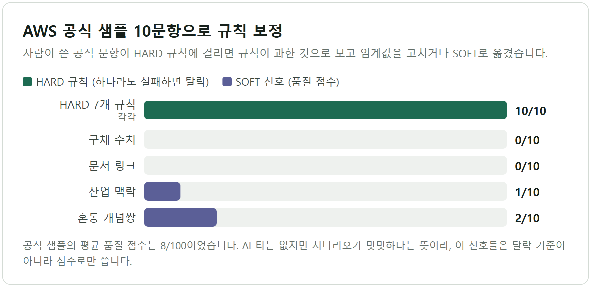
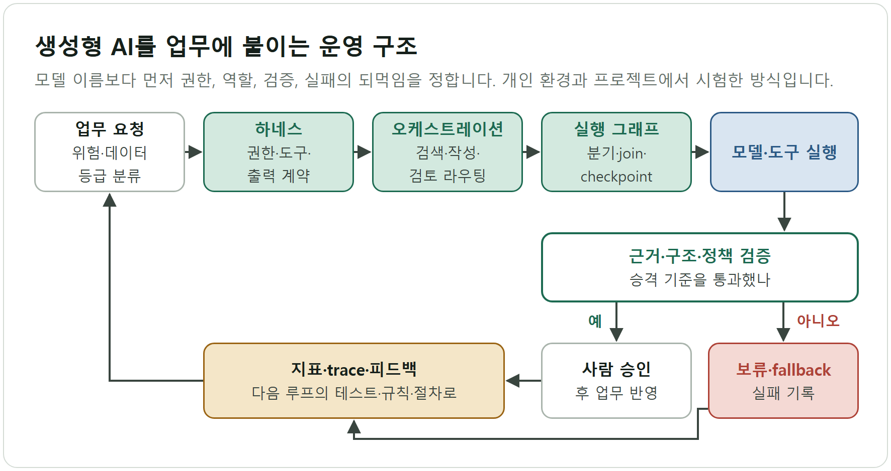

# 생성형 AI 결과를 믿을 수 있게 만드는 도구와 설계

> AI가 만든 객관식 문항의 AI 티를 규칙으로 걸러내는 품질 게이트(quiz-validator)와, 생성형 AI를 업무에 붙일 때 먼저 정할 경계·역할 분담·루프를 정리한 설계 저장소(ai-harness-loop-orchestration)를 한 사례로 묶었다. 앞의 것은 동작하는 코드이고, 뒤의 것은 그 코드가 놓인 운영 구조를 설명하는 문서다.

## 1. 한눈에 보기

| 구분 | quiz-validator | ai-harness-loop-orchestration |
|---|---|---|
| 형태 | Python CLI 도구 (MIT, 공개) | 문서 중심 공개 저장소 (Markdown 5편, YAML·Markdown 예시 2개) |
| 핵심 기술 | 정규식·통계 휴리스틱 11개 규칙, JSON 도메인 설정, 앵커 보정, 정답 분포 카이제곱 점검 | 하네스 계약, 위험 기반 오케스트레이션, 실행 그래프, 루프 설계 |
| 대표 결과 | AWS 공식 샘플 10문항이 HARD 규칙 10/10 통과, 평균 품질 점수 8/100 | 15개 프로젝트의 적용 방식을 오케스트레이션·하네스·루프 3축으로 정리 (성과 수치는 주장하지 않음) |

## 2. quiz-validator: AI 문항의 AI 티를 잡는 품질 게이트

**문제.** AI가 만든 객관식 문항은 "Which of the following BEST describes..." 같은 문장 틀, leverage·robust·seamless 같은 어휘, 길이가 비슷한 선택지, 해설 끝의 "In summary"를 반복한다. 한번 눈에 띄면 계속 보이는 패턴이라서, 출제 전에 기계적으로 걸러낼 장치가 필요했다.

**규칙 설계.** 판정을 두 층으로 나눴다. 규칙 값은 전부 JSON 설정(`aws-saa.json`)에 있고 코드(`quiz_validator.py`)는 도메인에 중립이다. 표준 라이브러리만 쓴다.

| 층 | 규칙 | 판정 방식 |
|---|---|---|
| HARD 7개 | 금지 문장 틀 4종, 금지 어휘 15개(활용형 포함), 허용 시작 패턴 5종, 선택지 길이 표준편차 8 이상, 최대-최소 길이 차 20 이상, em dash 1개 이하, 해설의 요약 문구 금지 | 하나라도 실패하면 문항 탈락 (종료 코드 1) |
| SOFT 4개 | 구체 수치 2개 이상, 산업 맥락, 혼동하기 쉬운 개념쌍(SQS/SNS 등 10세트), 해설의 공식 문서 링크 | 통과 비율을 0~100점 품질 점수로 환산 |

실행 모드는 단일 문항, `--batch` 디렉터리, `--calibrate` 세 가지다. `answer_distribution.py`는 정답 문자(A~E)의 분포를 카이제곱(임계값 7.81, 자유도 3, p=0.05)으로 점검해 문항 한 개가 아니라 세트 단위 쏠림도 본다. 새 도메인은 설정 파일을 복사하고 앵커 문항 10개를 모은 뒤, 앵커가 HARD를 전부 통과할 때까지 조정하는 순서로 추가한다.

**보정 방법과 결과.** 기준점은 AWS가 공개한 SAA-C03 공식 샘플 10문항이다(`anchor_aws_saa.json`, 수집일 2026-05-12). 사람이 쓴 공식 문항이 HARD 규칙에 걸리면 규칙이 과한 것이므로, 임계값을 조정하거나 그 규칙을 HARD에서 SOFT로 옮긴다(`quiz_validator.py`의 `--calibrate` 안내 문구). 결과는 다음과 같다.

| 항목 | 앵커 10문항 결과 |
|---|---|
| HARD 7개 규칙 | 각각 10/10 통과, 전체 HARD 통과율 100% |
| SOFT: 구체 수치 | 0/10 |
| SOFT: 해설의 문서 링크 | 0/10 |
| SOFT: 산업 맥락 | 1/10 |
| SOFT: 혼동 개념쌍 | 2/10 |
| 평균 품질 점수 | 8/100 |

근거는 `README.md`의 Calibration finding이다. 규칙별 수치는 레포 파일로 `python quiz_validator.py --domain aws-saa.json --calibrate`를 재실행해 같은 값을 확인했다. 평균 8점은 공식 샘플에 AI 티는 없지만 시나리오가 밋밋하다는 신호다. 구체 수치·문서 링크처럼 공식 샘플도 통과하지 못하는 신호는 설정에서 HARD가 아니라 SOFT에 있다. README는 이 검증기로 보정해 생성한 문항이 같은 HARD를 통과하면서 품질 80점 이상을 받을 수 있다고 적지만, 그 문항 세트와 점수는 공개 레포에 없다. 이 문서는 그 수치를 결과로 쓰지 않는다.

**한계.**
- 규칙 목록을 아는 사람에게는 우회가 쉽다. README도 이 도구를 최종 판정자가 아닌 강제 장치로 규정한다.
- 지나치게 깔끔한 논증 구조나 내적 일관성 같은 깊은 AI 티는 잡지 못한다.
- 사실 정확성과 의미 품질은 범위 밖이어서 별도 검증기가 필요하다(`docs/LEARNING_GUIDE.md`).
- 앵커는 한 도메인·10문항이고, 공개 설정은 AWS SAA 하나이며 금지 어휘는 영어 기준이다.
- 단위 테스트 파일은 없다. `--calibrate`가 유일한 자동 점검이다.

## 3. AI 하네스·오케스트레이션: 모델보다 먼저 정할 운영 구조

**무엇을 왜 정리했나.** 생성형 AI를 업무에 붙일 때 모델 이름보다 먼저 정할 것을 문서로 남겼다. AI가 무엇을 보고, 어떤 도구를 부르고, 언제 멈추고, 누가 승인하고, 실패가 다음 실행에 어떻게 반영되는지다. 이 저장소는 개인 개발환경과 프로젝트에서 구성·시험한 방식이며, 특정 기업의 내부 시스템 적용 성과나 모델 정확도·생산성을 주장하지 않는다.

**핵심 구조.** README의 흐름도는 요청이 하네스·오케스트레이션·그래프를 거쳐 검증을 통과해야 사람 승인으로 넘어가고, 실패는 기록으로 남아 다음 루프의 테스트·규칙이 되는 구조를 보여준다.

| 층 | 다루는 질문 | 대표 통제 |
|---|---|---|
| 하네스 | AI가 무엇에 접근하고 어떤 결과를 낼 수 있나 | 읽기·쓰기 권한 분리, 도구 allowlist, `answer`·`evidence`·`status` 같은 출력 필드, 비밀값·개인정보 제외 |
| 오케스트레이션 | 역할을 어떻게 나누나 | 분류, 승인 문서 검색, 초안, 규칙 검증, 담당자 검토, 반영 순서. 단순 업무는 단일 호출로 둠 |
| 그래프 | 어떤 상태에서 어떤 노드가 실행되나 | 노드·엣지·state·checkpoint, 병렬 검증 후 join, 사람 승인 interrupt (지식 그래프가 아닌 업무 실행 그래프) |
| 루프 | 결과를 다음 실행에 어떻게 돌려보내나 | 기준선, 파일럿, trace, 평가와 사람 검토, 승격·보류·롤백, 실패 분류, 테스트·규칙 갱신 |

설계 판단은 세 가지로 요약된다. 하네스의 권한이 그래프 노드 계약보다 우선해서, `write` 노드가 있어도 승인 전이면 `waiting_human_approval`이나 `blocked`로 끝낸다. 그래프는 먼저 만들지 않고 trace에서 반복되는 분기만 노드로 고정한다(`Trace first, formalize second`). 검증되지 않은 결과는 확정하지 않고 `draft`·`review`·`blocked`로 닫는다. 계약 예시는 `examples/graph-run-contract.yaml`(승인 문서 Q&A 그래프)과 `examples/pilot-charter.md`(제조·품질·고객지원 파일럿 계약)에 있고, 파일럿 계약은 비식별·가상 입력만 쓴다.

**실제 적용한 프로젝트.** `docs/project-specific-applications.md`는 15개 프로젝트의 정체와 오케스트레이션·하네스·루프 매핑을 정리한다. 공개 링크가 있는 것은 6개이고, 나머지는 코드·데이터·실험 결과를 복사하지 않고 목적과 적용 방식만 적었다. 모두 개인·학습·팀 프로젝트이며 기업 내부 성과가 아니다. 문서는 프로젝트마다 확인 가능한 범위만 매핑했고 성능·생산성 수치는 담지 않았다.

| 프로젝트 | 하네스(경계) | 루프(환류) |
|---|---|---|
| quiz-validator (공개) | 규칙·샘플·임계값 고정 | 놓친 유형을 규칙·테스트·점수 보고에 추가 |
| ssafy-race (공개) | 완주율·충돌·패널티·p95 loop time 게이트 | 개선이면 keep, 안정성이 떨어지면 revert 후 다음 가설 |
| strategy-arena (공개) | 기간·OOS·리스크 한도 경계 | 실패 원인과 재현성을 다음 실험에 반영 |
| StockPulse AI (비공개) | 규칙 결과·LLM 설명·근거 계산 분리, 모델 실패 시 결정론적 fallback | Playwright·trace 오류를 규칙 테스트와 fallback 조건에 반영 |
| codex-global-skills (비공개) | 인증 파일·API 키·브라우저 세션을 배포 대상에서 제외 | 환경별 실패를 호환성 체크리스트에 반영 |

**한계.** 이 저장소는 문서와 계약 예시이며 실행 가능한 하네스 구현이 없다. 효과를 보여주는 측정값도 없다. 비공개 프로젝트의 근거는 공개 자료로 검증할 수 없다. 그래프 가이드는 외부 공개 자료를 설계 계약으로 옮긴 학습 자료이고 특정 제품의 내부 구조를 재현하지 않는다. quiz-validator는 이 설계 중 출력 게이트 한 칸을 코드로 구현한 사례이며, 하네스 문서는 이를 "생성 문항 → 규칙 → 공식 샘플 calibration → HARD/SOFT 판정" 흐름으로 매핑한다.

## 4. 기술 스택

- 검증 도구: Python 3 (표준 라이브러리 `argparse`·`json`·`re`·`statistics`), JSON 설정, 정규식, 표준편차·카이제곱
- 설계 문서: Markdown, Mermaid, YAML 계약 예시
- 라이선스: quiz-validator는 MIT

## 5. 링크

- quiz-validator: https://github.com/tttksj404/quiz-validator
- ai-harness-loop-orchestration: https://github.com/tttksj404/ai-harness-loop-orchestration
